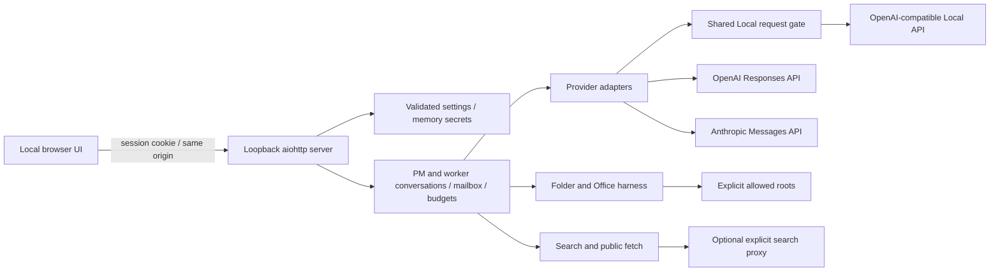

# Architecture and extension points

- `workbench/config.py`: input validation, defaults, atomic public settings persistence, memory/environment key references.
- `workbench/server.py`: private state directory, one-use browser bootstrap, origin/host checks, HTTP API, bounded model-list connectivity test.
- `workbench/engine.py`: independently maintained conversations, role assignment, per-run budgets, worker mail, paused questions, reservations, shutdown/draining.
- `workbench/providers.py`: stateless wire conversions. OpenAI native response output is replayed with encrypted reasoning; Anthropic thinking signatures/redacted blocks remain intact; Local native content/reasoning is retained. Display reasoning is separate from protocol data.
- `workbench/resources.py`: shared Local admission control, queue limits, start interval, bounded retry settings, fixed NVIDIA query. A failed or cancelled request releases its slot.
- `workbench/harness.py`: all model-directed filesystem operations and Office parsing/writing.
- `workbench/webtools.py`: bounded search and fetch, proxy use, public address validation/pinning.
- `static/`: dependency-free Japanese UI; polling and cards, settings, mail and expandable provider-returned reasoning.
- `docs/interface.json`: UI/API contract and default settings source. This source distribution uses an editable install, retaining `static/` and `docs/` beside the package.

## Execution semantics

PM starts from the exact visible user task plus the shared policy and verified runtime identity. `spawn_worker` starts another independent conversation on an allowed profile. Only PM can create workers; workers can contact existing teammates. Human messages are prioritized, preserving order. Worker completion messages wake PM without a human click. Repeated mail still consumes per-run calls and per-agent turns.

The app does not force a fixed number of agents on every request. PM decides whether delegation is useful and calls the real tool; no tool call means no pretend worker. Roles are task-specific text. An idle PM with outstanding workers is waiting for mail. A human question pauses that agent; peers can still proceed. Settings cannot change while teams are active/waiting/stopping. After a completed run's settings change, follow-up requires a new run so old permissions cannot be revived.

Snapshots contain bounded display logs. Full protocol history remains in process memory, bounded at the next model request by the context character limit. There is no silent truncation of tool history and no hidden summarizer; budget exhaustion is surfaced as an error. The UI can receive another instruction, but spent run/turn budgets are not reset.

## Adding tools

Implement narrowly scoped operations through `ToolExecutor` or a similarly validated subsystem. Validate every model argument independently of schema declarations, check folder scope before I/O, bound output, provide a result for every call, and test cancellation. Do not add raw `subprocess`, unrestricted Python/PowerShell, arbitrary HTTP requests, or filesystem APIs callable by model text; these would bypass the current security model.

## API references used

- [OpenAI function calling](https://developers.openai.com/api/docs/guides/function-calling)
- [OpenAI reasoning](https://developers.openai.com/api/docs/guides/reasoning)
- [Anthropic tool calls](https://platform.claude.com/docs/en/agents-and-tools/tool-use/handle-tool-calls)
- [Anthropic extended thinking](https://platform.claude.com/docs/en/build-with-claude/extended-thinking)

The transport supports reasoning blocks that the provider actually returns. There is currently no UI to configure provider-specific thinking budgets or model-server loading parameters. Model availability and account permissions are supplied by the user, not hard-coded.
