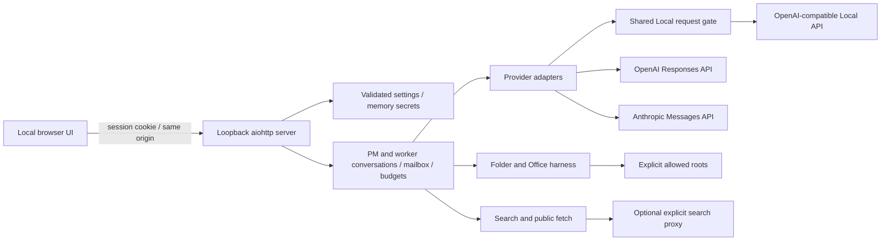

# Architecture and extension points

- `workbench/config.py`: input validation, defaults, atomic public settings persistence, memory/environment key references.
- `workbench/server.py`: private state directory, one-use browser bootstrap, origin/host checks, HTTP API, bounded model-list connectivity test.
- `workbench/engine.py`: independently maintained conversations, role assignment, per-run budgets, worker mail, paused questions, reservations, shutdown/draining.
- `workbench/providers.py`: stateless wire conversions. OpenAI native response output is replayed with encrypted reasoning; Anthropic thinking signatures/redacted blocks remain intact; Local native content/reasoning is retained. Display reasoning is separate from protocol data.
- `workbench/resources.py`: shared Local admission control, queue limits, start interval, bounded retry settings, fixed NVIDIA query. A failed or cancelled request releases its slot.
- `workbench/harness.py`: all model-directed filesystem operations and Office parsing/writing.
- `workbench/webtools.py`: bounded search and fetch, proxy use, public address validation/pinning.
- `static/`: dependency-free Japanese UI; polling and cards, settings, mail and expandable provider-returned reasoning.
- `docs/interface.json`: UI/API contract and default settings source. This source distribution uses an editable install, retaining `static/` and `docs/` beside the package.

## Execution semantics

PM starts from the exact visible user task plus the shared policy and verified runtime identity. `spawn_worker` starts another independent conversation on an allowed profile. Only PM can create workers; workers can contact existing teammates. Human messages are prioritized, preserving order. Worker completion messages wake PM without a human click. Repeated mail still consumes per-run calls and per-agent turns.

`limits.max_auto_collaborations` independently bounds automatic handoffs for the whole run (default 24, integer 0–1000). A successful worker spawn and initial assignment, a delivered `send_message`, and a delivered automatic worker completion/error notice each consume one unit. Human requests/replies, ordinary model/tool calls, and failed deliveries do not. Zero permits PM-only work without automated handoffs. The run snapshots expose `auto_collaborations`, `max_auto_collaborations`, and `collaboration_limit_reached`. Once exhausted, new delegation/mail is rejected while started and queued work may finish. A blocked handoff leaves a visible limit notice rather than automatically presenting the whole team as successfully done. Human follow-ups can direct PM to finish without further handoffs but never replenish this budget; changing settings requires a new run. The public limit notice persists to explain why further handoffs are unavailable even after a human follow-up. Existing settings files without this field inherit 24.

The app does not force a fixed number of agents on every request. PM decides whether delegation is useful and calls the real tool; no tool call means no pretend worker. Roles are task-specific text. An idle PM with outstanding workers is waiting for mail. A human question pauses that agent; peers can still proceed. Settings cannot change while teams are active/waiting/stopping. After a completed run's settings change, follow-up requires a new run so old permissions cannot be revived.

Snapshots contain bounded display logs. Full protocol history remains in process memory, bounded at the next model request by the context character limit. There is no silent truncation of tool history and no hidden summarizer; budget exhaustion is surfaced as an error. The UI can receive another instruction, but spent run/turn budgets are not reset.

## Adding tools

Implement narrowly scoped operations through `ToolExecutor` or a similarly validated subsystem. Validate every model argument independently of schema declarations, check folder scope before I/O, bound output, provide a result for every call, and test cancellation. Do not add raw `subprocess`, unrestricted Python/PowerShell, arbitrary HTTP requests, or filesystem APIs callable by model text; these would bypass the current security model.

## API references used

- [OpenAI function calling](https://developers.openai.com/api/docs/guides/function-calling)
- [OpenAI reasoning](https://developers.openai.com/api/docs/guides/reasoning)
- [Anthropic tool calls](https://platform.claude.com/docs/en/agents-and-tools/tool-use/handle-tool-calls)
- [Anthropic extended thinking](https://platform.claude.com/docs/en/build-with-claude/extended-thinking)

The transport supports reasoning blocks that the provider actually returns. There is currently no UI to configure provider-specific thinking budgets or model-server loading parameters. Model availability and account permissions are supplied by the user, not hard-coded.

### Public work state and reply admission (0.1.1.dev2)

`Agent.assignment` is the original PM or worker brief. It is separate from the private
asyncio `Agent.task`; later human replies and peer envelopes do not alter the brief.
Snapshots apply the same recursive secret redaction to this field as to other strings.
`parent_id`, not the free-text role, determines PM/worker identity in the UI.

Scheduler `status` values are unchanged. The additive `status_reason` is a read-only
projection: agents can explain human-input waiting, unfinished teammates or a teammate
error; waiting runs explain human input, errors, collaboration limits or mixed attention.
This is not a new source of scheduling authority. A working task remains working when
another human instruction is queued. A completed worker can retain its completed status
when automatic delivery of its result is blocked; the run separately explains the limit.

Each snapshot agent also has `message_eligibility: {allowed, reason, message}`. The human
message endpoint invokes the same current-state check before enqueueing. Closed/stopping/
stopped runs, stale configuration, a full 32-message human queue, or exhausted per-agent
turn, run-time, run-model or agent-context limits reject with an explanation. Rejection
leaves pending work, questions, errors and status unchanged. A snapshot is only a hint:
other work or elapsed time can change eligibility before POST, and an accepted message
may subsequently hit a limit. Existing permission checks and loop budget checks remain.
Tool-budget exhaustion permits a text-only answer and is shown as a warning. Automatic
collaboration exhaustion also permits human direction; neither kind of reply refills any
budget. Starting a new run is required for changed configuration or fresh hard budgets.

### Selected-detail state projection (0.1.1.dev6)

`GET /api/state` retains the complete original snapshot contract. The cockpit uses
`GET /api/state?view=selected&run_id=...&agent_id=...`. Every run and every agent's
public metadata remains present; only the selected agent includes `logs`, `results`
and `output_receipts`. Omission means unloaded, never an empty retained history.
`selection` explicitly identifies the requested run/agent and `detail_loaded` state.
Without IDs the response contains summaries; run-only selection includes activity.
Unknown or mismatched IDs are rejected. Activity is filtered to the selected run
before taking its last 100 events, in chronological transport order.

Both projections independently redact the data they expose. Unselected histories
are not materialized or visited; conversation context remains private. All metadata
and message eligibility are freshly evaluated, including deadline changes without
new events. Authentication, origin checks, `no-store`, and the public configuration
endpoint are unchanged. The compact view is not an authorization boundary between
agents: the authenticated user can still request the full snapshot.

Frontend response ownership includes a monotonically changing selection generation.
Returning to the same IDs does not authorize an older request. Polling remains
single-flight and refreshes the current selection after superseded work completes.
A new selection displays a loading state and cannot copy/export another owner's
content. Successful unchanged refreshes preserve existing detail and control nodes.

### Run-scoped configured profile identity (0.1.1.dev7)

Every public agent includes `configured_profile`: `{id, label, kind, model}` or
`null` when the original descriptor is unavailable. Both complete and compact
state include the same descriptor, including unselected summaries. It describes
configuration at run admission, not successful inference or a verified served
model. Provider aliases may resolve elsewhere and are not probed by this feature.

At `start_run`, an explicit allowlist is projected from the admitted configuration
for the PM and allowed worker profiles. These descriptors are redacted immediately
and kept in the run's private in-memory `_configured_profiles` map. Capture-time
redaction prevents later removal of a profile or environment-secret reference
from revealing previously redacted descriptor text, including for workers created
later. Public projection returns independent copies and still applies ordinary
snapshot redaction. The private inference configuration is not altered.

The UI never joins retained agents to current editable settings. Missing descriptors
produce an explicit unknown state; there is no current-settings fallback. Existing
settings-change reply restrictions remain. Explicit report/receipt text exports
include only the selected record plus its run/agent and configured-profile identity.
Names and model values are JSON-quoted to distinguish embedded newlines/delimiters.
No URL, proxy, key reference, policy or directory scope is added to this metadata.
There is no new persistence, download endpoint, model request or permission change.
