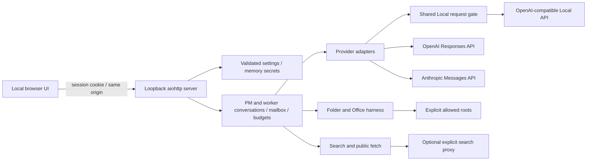

# Architecture and extension points

- `workbench/config.py`: input validation, defaults, atomic public settings persistence, memory/environment key references.
- `workbench/server.py`: private state directory, one-use browser bootstrap, origin/host checks, HTTP API, bounded model-list connectivity test.
- `workbench/engine.py`: independently maintained conversations, role assignment, per-run budgets, worker mail, paused questions, reservations, shutdown/draining.
- `workbench/providers.py`: stateless wire conversions. OpenAI native response output is replayed with encrypted reasoning; Anthropic thinking signatures/redacted blocks remain intact; Local native content/reasoning is retained. Display reasoning is separate from protocol data.
- `workbench/resources.py`: shared Local admission control, queue limits, start interval, bounded retry settings, fixed NVIDIA query. A failed or cancelled request releases its slot.
- `workbench/harness.py`: all model-directed filesystem operations and Office parsing/writing.
- `workbench/webtools.py`: bounded search and fetch, proxy use, public address validation/pinning.
- `workbench/webtext.py`: isolated strict declaration-aware decoding and provenance, with a fixed codec allowlist.
- `static/`: dependency-free Japanese UI; polling and cards, settings, mail and expandable provider-returned reasoning.
- `docs/interface.json`: UI/API contract and default settings source. This source distribution uses an editable install, retaining `static/` and `docs/` beside the package.

## Execution semantics

PM starts from the exact visible user task plus the shared policy and verified runtime identity. `spawn_worker` starts another independent conversation on an allowed profile. Only PM can create workers; workers can contact existing teammates. Human messages are prioritized, preserving order. Worker completion messages wake PM without a human click. Repeated mail still consumes per-run calls and per-agent turns.

`limits.max_auto_collaborations` independently bounds automatic handoffs for the whole run (default 24, integer 0–1000). A successful worker spawn and initial assignment, a delivered `send_message`, and a delivered automatic worker completion/error notice each consume one unit. Human requests/replies, ordinary model/tool calls, and failed deliveries do not. Zero permits PM-only work without automated handoffs. The run snapshots expose `auto_collaborations`, `max_auto_collaborations`, and `collaboration_limit_reached`. Once exhausted, new delegation/mail is rejected while started and queued work may finish. A blocked handoff leaves a visible limit notice rather than automatically presenting the whole team as successfully done. Human follow-ups can direct PM to finish without further handoffs but never replenish this budget; changing settings requires a new run. The public limit notice persists to explain why further handoffs are unavailable even after a human follow-up. Existing settings files without this field inherit 24.

The app does not force a fixed number of agents on every request. PM decides whether delegation is useful and calls the real tool; no tool call means no pretend worker. Roles are task-specific text. An idle PM with outstanding workers is waiting for mail. A human question pauses that agent; peers can still proceed. Settings cannot change while teams are active/waiting/stopping. After a completed run's settings change, follow-up requires a new run so old permissions cannot be revived.

Snapshots contain bounded display logs. Full protocol history remains in process memory, bounded at the next model request by the context character limit. There is no silent truncation of tool history and no hidden summarizer; budget exhaustion is surfaced as an error. The UI can receive another instruction, but spent run/turn budgets are not reset.

### Tool-result closure (0.1.1.dev15)

Expected validation/access errors remain ordinary failed tool results. XLSX writes
to non-anchor merged cells now fail validation before saving the workbook; the
caller must explicitly select its existing top-left cell. No unmerge or redirected
write is performed, and earlier in-memory changes from that same request are not saved.

Unexpected ordinary exceptions during tool execution, result-shape inspection,
strict JSON serialization or tool-log preparation close the current provider batch.
The attempted call receives a fixed error saying completion was not confirmed;
each later call receives an unexecuted result without consuming another tool call.
Each result is appended once, after preparation. The agent then enters its existing
error state and waits for explicit human direction under unchanged admission limits.
Other agents and ordinary worker-error notification retain their existing behavior.

Successful earlier results and save receipts remain intact. An unexpected failure
can occur after a file was committed, including before a receipt was recorded, so
no rollback/no-effects claim or automatic replay is made. Private exception text,
arguments and tracebacks are not included in this fixed unexpected-error message.
Cancellation still drains in-flight file operations; redaction-capacity failure
still takes its dedicated fail-closed path. Neither is treated as an ordinary
recoverable batch exception. Provider-native response/reasoning history is preserved.

## Adding tools

Implement narrowly scoped operations through `ToolExecutor` or a similarly validated subsystem. Validate every model argument independently of schema declarations, check folder scope before I/O, bound output, provide a result for every call, and test cancellation. Do not add raw `subprocess`, unrestricted Python/PowerShell, arbitrary HTTP requests, or filesystem APIs callable by model text; these would bypass the current security model.

## API references used

- [OpenAI function calling](https://developers.openai.com/api/docs/guides/function-calling)
- [OpenAI reasoning](https://developers.openai.com/api/docs/guides/reasoning)
- [Anthropic tool calls](https://platform.claude.com/docs/en/agents-and-tools/tool-use/handle-tool-calls)
- [Anthropic extended thinking](https://platform.claude.com/docs/en/build-with-claude/extended-thinking)

The transport supports reasoning blocks that the provider actually returns. There is currently no UI to configure provider-specific thinking budgets or model-server loading parameters. Model availability and account permissions are supplied by the user, not hard-coded.

### Public work state and reply admission (0.1.1.dev2)

`Agent.assignment` is the original PM or worker brief. It is separate from the private
asyncio `Agent.task`; later human replies and peer envelopes do not alter the brief.
Snapshots apply the same recursive secret redaction to this field as to other strings.
`parent_id`, not the free-text role, determines PM/worker identity in the UI.

Scheduler `status` values are unchanged. The additive `status_reason` is a read-only
projection: agents can explain human-input waiting, unfinished teammates or a teammate
error; waiting runs explain human input, errors, collaboration limits or mixed attention.
This is not a new source of scheduling authority. A working task remains working when
another human instruction is queued. A completed worker can retain its completed status
when automatic delivery of its result is blocked; the run separately explains the limit.

Each snapshot agent also has `message_eligibility: {allowed, reason, message}`. The human
message endpoint invokes the same current-state check before enqueueing. Closed/stopping/
stopped runs, stale configuration, a full 32-message human queue, or exhausted per-agent
turn, run-time, run-model or agent-context limits reject with an explanation. Rejection
leaves pending work, questions, errors and status unchanged. A snapshot is only a hint:
other work or elapsed time can change eligibility before POST, and an accepted message
may subsequently hit a limit. Existing permission checks and loop budget checks remain.
Tool-budget exhaustion permits a text-only answer and is shown as a warning. Automatic
collaboration exhaustion also permits human direction; neither kind of reply refills any
budget. Starting a new run is required for changed configuration or fresh hard budgets.

### Selected-detail state projection (0.1.1.dev6)

`GET /api/state` retains the complete original snapshot contract. The cockpit uses
`GET /api/state?view=selected&run_id=...&agent_id=...`. Every run and every agent's
public metadata remains present; only the selected agent includes `logs`, `results`
and `output_receipts`. Omission means unloaded, never an empty retained history.
`selection` explicitly identifies the requested run/agent and `detail_loaded` state.
Without IDs the response contains summaries; run-only selection includes activity.
Unknown or mismatched IDs are rejected. Activity is filtered to the selected run
before taking its last 100 events, in chronological transport order.

Both projections independently redact the data they expose. Unselected histories
are not materialized or visited; conversation context remains private. All metadata
and message eligibility are freshly evaluated, including deadline changes without
new events. Authentication, origin checks, `no-store`, and the public configuration
endpoint are unchanged. The compact view is not an authorization boundary between
agents: the authenticated user can still request the full snapshot.

Frontend response ownership includes a monotonically changing selection generation.
Returning to the same IDs does not authorize an older request. Polling remains
single-flight and refreshes the current selection after superseded work completes.
A new selection displays a loading state and cannot copy/export another owner's
content. Successful unchanged refreshes preserve existing detail and control nodes.

### Run-scoped configured profile identity (0.1.1.dev7)

Every public agent includes `configured_profile`: `{id, label, kind, model}` or
`null` when the original descriptor is unavailable. Both complete and compact
state include the same descriptor, including unselected summaries. It describes
configuration at run admission, not successful inference or a verified served
model. Provider aliases may resolve elsewhere and are not probed by this feature.

At `start_run`, an explicit allowlist is projected from the admitted configuration
for the PM and allowed worker profiles. These descriptors are redacted immediately
and kept in the run's private in-memory `_configured_profiles` map. Capture-time
redaction prevents later removal of a profile or environment-secret reference
from revealing previously redacted descriptor text, including for workers created
later. Public projection returns independent copies and still applies ordinary
snapshot redaction. The private inference configuration is not altered.

The UI never joins retained agents to current editable settings. Missing descriptors
produce an explicit unknown state; there is no current-settings fallback. Existing
settings-change reply restrictions remain. Explicit report/receipt text exports
include only the selected record plus its run/agent and configured-profile identity.
Names and model values are JSON-quoted to distinguish embedded newlines/delimiters.
No URL, proxy, key reference, policy or directory scope is added to this metadata.
There is no new persistence, download endpoint, model request or permission change.

### Truthful bounded web-text decoding (0.1.1.dev8)

`web_fetch` keeps its request, redirect, TLS, DNS pinning, explicit-proxy, timeout,
decompressed-byte and accepted-MIME boundaries. Only the already-bounded byte
response enters `decode_web_text`. `web_search` JSON handling is unchanged.

The result adds `encoding` (actual Python codec), `encoding_source` and
`encoding_assumed` before `text`, alongside URL, MIME, untrusted status and
truncation. This keeps provenance visible in the existing 12,000-character tool
log preview. `truncated` measures cleaned/extracted text, with a 200,000-character
return bound. Full protocol history remains subject to existing context budgets.

Selection sources:
- `bom`: UTF-8/UTF-16LE/UTF-16BE signature, removed only at the start and authoritative
  over declarations. UTF-32 signatures are rejected before the UTF-16 prefix check.
- `http_charset`: one unambiguous ordinary Content-Type charset parameter. Quoted
  values/escaped quotes and unrelated quoted semicolons are parsed; malformed,
  duplicate (even equal), empty and RFC2231 extended charset parameters fail.
- `html_meta`: an eligible complete declaration within the first 1,024 bytes, before
  any script/style/title/textarea/xmp/iframe/noembed/noframes/noscript/plaintext or
  template element. Scanning stops permanently at these raw/inert elements, including
  HTML self-closing spellings, because Python HTMLParser cannot reproduce the browser
  script double-escape states. Later meta is deliberately ignored even within the
  byte bound. Comments/other attributes are not declarations; attribute entities are
  not decoded. A direct charset takes priority over content-style syntax, which needs
  http-equiv=content-type. The first selected declaration wins; unsupported or
  ambiguous selected declarations fail. Meta UTF-16 labels become UTF-8 and meta
  x-user-defined becomes Windows-1252. No parse restart or locale heuristic occurs.
- `xml_declaration`: XHTML only, anchored ASCII XML declaration wholly within 1,024
  bytes, with version and optional encoding/standalone fields. BOM/header have priority;
  HTML meta is ignored. An ASCII prolog cannot select UTF-16; that needs a BOM or an
  explicit LE/BE HTTP charset. No entity/DTD resolution or XML validation is attempted.
- `xml_default`: XHTML without applicable declarations uses the XML UTF-8 default.
- `json_utf8`: application/json always uses strict UTF-8, ignoring charset parameters;
  a leading UTF-8 BOM is tolerated/removed. Other Unicode BOMs and raw NUL bytes fail.
- `default_utf8`: other undeclared text assumes UTF-8 and sets `encoding_assumed=true`.
  NUL-bearing input fails as uncertain rather than losing interleaved NULs in cleanup.

The fixed decoder families are UTF-8, UTF-16LE/BE, CP932 (Shift_JIS/Windows-31J
compatibility aliases), EUC-JP, ISO-2022-JP, Windows-1252, ASCII and ISO-8859-1.
HTML ASCII/Latin-1 aliases select Windows-1252; non-HTML keeps ASCII/ISO-8859-1.
Only explicitly enumerated labels are accepted. UTF-16 without a BOM means LE in
HTML; generic UTF-16 elsewhere requires a BOM. Unicode case conversion cannot
introduce a supported label: ASCII validation precedes lowercasing.

Strict decoding establishes byte validity for the selected codec, not the accuracy
of a publisher's declaration. No replacement text or alternate-codec retry is used.
Python legacy codecs are not claimed to be byte-identical to WHATWG decoders, and
this extractor is neither a complete browser parser nor a universal encoding detector.
No new dependency, remote detection service or model/browser call is added.
## Credential-mask lifecycle (0.1.1.dev9)

`Engine` owns an output-only `SecretRedactor`; authentication still comes from
current `Settings` and explicitly resolved per-request keys. Config/secret routes
prepare the union of current and prospective masks before mutating anything, then
commit synchronously. Settings persistence failure does not commit masks or change
memory credentials. Removing/changing a provider identity retires its memory auth;
search uses a fresh per-dispatch tool copy with current auth and frozen run policy.

The registry has count/payload limits and no eviction. Public tree projections take
one current redactor and still omit unselected heavy histories before traversal.
Literal `str.find` plus a bounded min-heap implements leftmost-longest substitution
without regex-prefix stalls, unbounded match lists or replacement-marker rematching.
Capacity errors use a fixed safe branch, including nested agent-error handling.
No fallback serializes an unmasked state. See SECURITY.md for retained-memory,
editable-config, private-conversation, file and previously-delivered-data exclusions.

## Saved-destination credential writes (0.1.1.dev12)

`Settings.revision` is a process-local monotonic integer returned as
`config_revision` alongside public settings. A successful settings save increments
it after atomic file replacement; failed validation, disk writes and mask-capacity
checks do not. It stays outside `Settings.value`, persisted JSON and frozen run
configuration. `POST /api/secrets` requires an exact current revision and validates
the saved provider/search destination before calling `Engine.set_secret`, without
an intervening await. The response is a value-free acceptance receipt, not a live
provider test. There is no legacy unguarded request path.

The frontend separates configuration locking from saved credential eligibility.
Each saved target has independent pending ownership; configuration writes and
reload/discard wait for all key requests to settle. Local configuration/dialog
ownership prevents delayed feedback from overwriting a newer context. Passwords
are not copied into UI draft state. A local GET-based discard rebinds settings while
preserving task text, conversation drafts, empty worker selections, unavailable old
selections and requested worker count. New server settings are still enforced by
normal preflight/start validation; reloading is not permission to silently rewrite
the user's task draft.

Key operations invalidate diagnostics but do not mutate run configuration or
scheduler queues. The ordinary explicit human-message API remains the only recovery
instruction, and its current settings/budget/context/stop checks remain unchanged.
